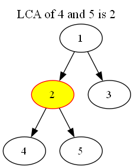

# Binary Lifting Tree LCA Finder and Visualizer

## Overview
This Python script allows users to compute the **Lowest Common Ancestor (LCA)** of nodes in a tree using the **binary lifting algorithm**. It also provides a visualization of the tree with the LCA node highlighted for each query.

---

## Features
- **Tree Parsing**: Reads a tree from a file where each line specifies an edge between two nodes.
- **Binary Lifting Preprocessing**: Efficiently prepares the tree structure for fast LCA queries.
- **LCA Query**: Quickly computes the LCA of two nodes.
- **Tree Visualization**: Highlights the computed LCA on the tree using Graphviz.

---

## Requirements
### Python Libraries
- **Graphviz**: Used for generating tree visualizations. Install via pip:
  ```bash
  pip install graphviz
  ```
- **math** and **time**: Built-in Python libraries for computations and performance measurements.

### System Requirements
- Graphviz must be installed on your system for tree visualizations. Install it using:
  - **Ubuntu/Debian**: `sudo apt install graphviz`
  - **MacOS**: `brew install graphviz`
  - **Windows**: Download and install from the [Graphviz website](https://graphviz.org/download/).

---

## Input File Format
The input file should follow these conventions:
1. **First Line**: Number of nodes in the tree (`n`).
2. **Next n-1 Lines**: Each line specifies an edge in the form `u v`, where `u` and `v` are connected nodes.

### Example File (`tree.txt`):
```
5
1 2
1 3
2 4
2 5
```
This represents the following tree:
```
    1
   / \
  2   3
 / \
4   5
```

---

## How to Run
1. **Save the Script**: Save the code to a file (e.g., `LCA.py`).
2. **Prepare the Input File**: Create a text file containing the tree structure (e.g., `tree.txt`).
3. **Run the Script**:
   ```bash
   python LCA.py
   ```
4. **Follow Prompts**:
   - Enter the filename of the tree input file.
   - Specify the number of LCA queries.
   - Input node pairs for which the LCA is to be computed.

---

## Output
1. **Query Results**: Displays the LCA and query processing time in milliseconds.
   Example:
   ```
   Enter the filename containing the tree: tree.txt
   Enter number of queries: 1
   Enter query (u v): 4 5
   LCA of 4 and 5 is 2. Query time: 0.100 ms
   ```

2. **Tree Visualization**: Generates and saves a visual representation of the tree with the LCA node highlighted. Files are saved as `tree_{u}_{v}.png` (e.g., `tree_4_5.png`).

---

## Functions
- **`read_tree_from_file(filename)`**: Reads the tree structure from a file.
- **`binary_lifting_preprocessing(tree, n, root=1)`**: Preprocesses the tree for LCA queries.
- **`lca(u, v, up, depth)`**: Computes the LCA of nodes `u` and `v`.
- **`visualize_tree(edges, lca_node, query, output_file)`**: Generates a tree visualization using Graphviz.
- **`main()`**: Handles user input and manages the overall flow of the program.

---

## Example Visualization
A visualization of the tree with the LCA node highlighted:


---

## Notes
- Ensure the input tree is connected and undirected.
- Nodes are expected to be numbered from `1` to `n`.
- The program assumes a single connected component in the input.

---

## Project Type
This project is part of an **Algorithm Design** course, focusing on the implementation and application of efficient algorithms such as binary lifting for solving tree-related problems.

---

## License
This script is provided under the MIT License. Feel free to use, modify, and distribute it.

---

## Author
Developed by Mohammad Tavakoli. For questions or improvements, feel free to [contact me](www.linkedin.com/in/mohammadhasan-tavakoli-3551b6215)!

